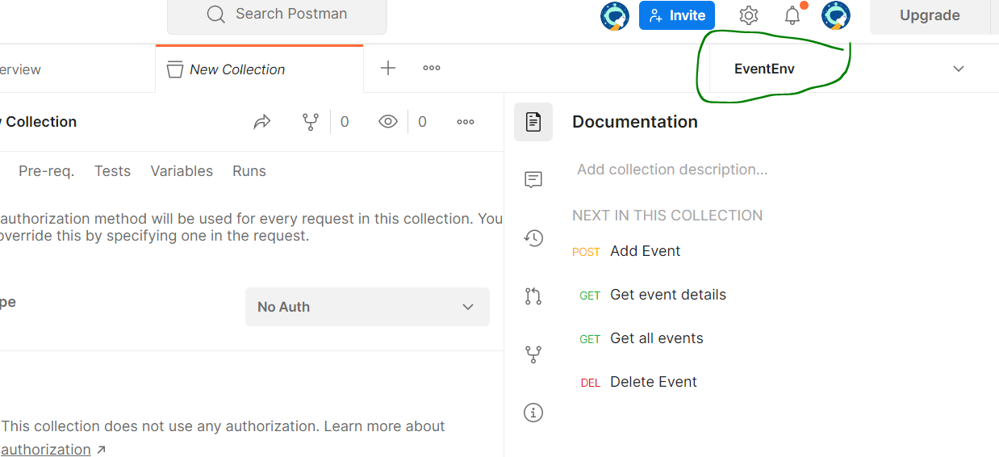
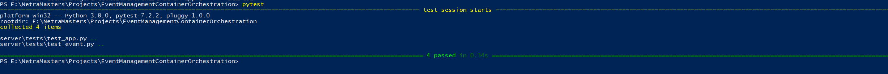
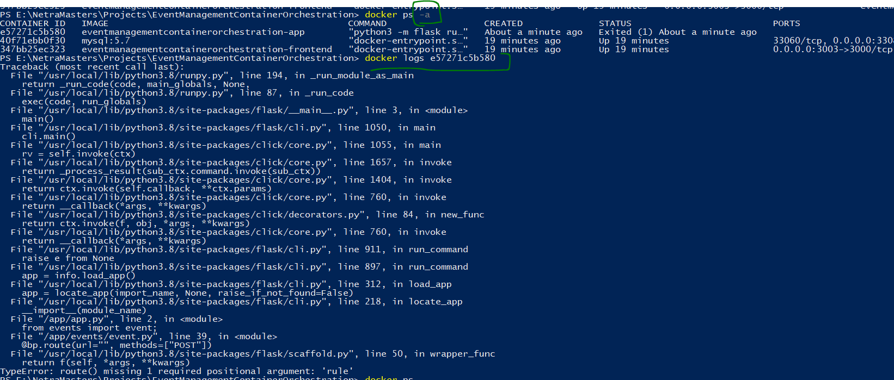

# EventManagement-Container Orchestration

Event management appilcation deals with performing CRUD operations on Events.
This is client-server application.
- [Client](frontend) : React UI application which consumes event service
- [Server](server/app) : RESTFul API project developed in Flask python
- [Database](server/db/) : MySQL database with table event

# Author
- Name : Netra Amraale
- Email Id : amrale.netra@gmail.com

# Postman Collection
- [here](https://www.postman.com/red-water-456173/workspace/event/collection/2280968-f0de5d0f-7967-490d-af6e-1479caca91fc?ctx=documentation)
- Set Enviorment and update url
	
  
# Video Demo
- Link for video demo is [here](https://drive.google.com/file/d/1d5GhhHC4T_00rVYAyesMPOgZHH8H5y-x/view?usp=sharing)
- Raw file link is [here](output/video2097897558.mp4)

# Steps to run locally
- Install docker and docker compose (Note: If you install docker for desktop it comes with docker compose)
- Navigate to EventManagementContainerOrchestration folder and execute following command
	```
		docker compose up -d
	```

# Steps to run tests
- Navigate to test folder and execute following command
	```
		pytest
	```
- 

# Reference 
- [https://www.freecodecamp.org/news/how-to-dockerize-a-flask-app/](https://www.freecodecamp.org/news/how-to-dockerize-a-flask-app/)
- [https://flask.palletsprojects.com/en/2.2.x/tutorial/factory/](https://flask.palletsprojects.com/en/2.2.x/tutorial/factory/)
- https://github.com/huseinzol05/Python-DevOps/tree/master/basic-backend
- https://stackoverflow.com/questions/59012381/pytest-flask-application-attributeerror-module-src-api-has-no-attribute-test

# Troubleshooting 
- Running pytest encountered below error
			```oserror: [winerror 123] the filename, directory name, or volume label syntax is incorrect:
			```
	- Check folder, file name should not have special characters like '-' etc
- Cannot find module app
    - Copy absolute path of app folder
    - Add absolute path value to  enviornment varaible PYTHONPATH
	   - Windows
	   - Linux
	- Restart computer and verify.
- ERROR: readlink /var/lib/docker/overlay2: invalid argument
	- Remove all unused or dangling images and container.	
- Unable to see container
	```
		docker ps -a
		docker logs <containerID>
	```		
	
	
	